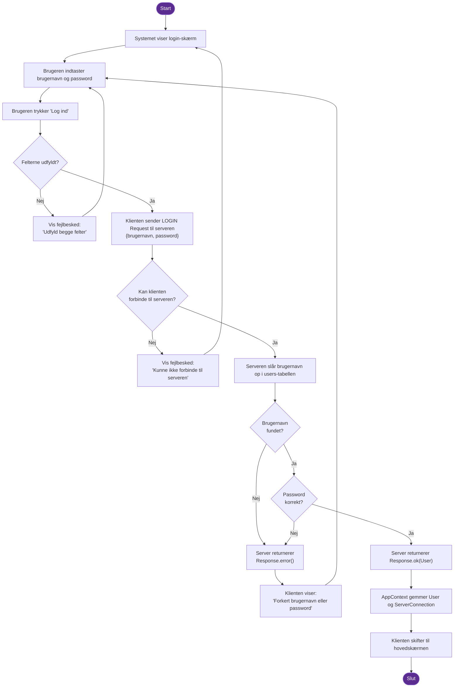

# Aktivitetsdiagram – UC01 Log ind

Kopiér koden nedenfor ind på https://mermaid.live

```mermaid
flowchart TD
    A([Start]) --> B["Systemet viser login-skærm"]
    B --> C["Brugeren indtaster brugernavn og password"]
    C --> D["Brugeren trykker 'Log ind'"]
    D --> E{Felterne udfyldt?}

    E -- Nej --> F["Vis fejlbesked:\n'Udfyld begge felter'"]
    F --> C

    E -- Ja --> G["Klienten sender LOGIN Request til serveren\n{brugernavn, password}"]
    G --> H{Kan klienten\nforbinde til serveren?}

    H -- Nej --> I["Vis fejlbesked:\n'Kunne ikke forbinde til serveren'"]
    I --> B

    H -- Ja --> J["Serveren slår brugernavn op i users-tabellen"]
    J --> K{Brugernavn\nfundet?}

    K -- Nej --> L["Server returnerer\nResponse.error()"]
    L --> M["Klienten viser:\n'Forkert brugernavn eller password'"]
    M --> C

    K -- Ja --> N{Password\nkorrekt?}

    N -- Nej --> L
    N -- Ja --> O["Server returnerer Response.ok(User)"]
    O --> P["AppContext gemmer User og ServerConnection"]
    P --> Q["Klienten skifter til hovedskærmen"]
    Q --> R([Slut])

    style A fill:#5c2d91,color:#fff
    style R fill:#5c2d91,color:#fff
```
