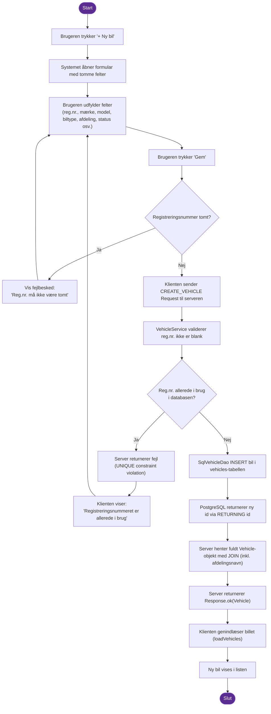

# Aktivitetsdiagram – UC04 Opret bil

Kopiér koden nedenfor ind på https://mermaid.live

```mermaid
flowchart TD
    A([Start]) --> B["Brugeren trykker '+ Ny bil'"]
    B --> C["Systemet åbner formular med tomme felter"]
    C --> D["Brugeren udfylder felter\n(reg.nr., mærke, model, biltype, afdeling, status osv.)"]
    D --> E["Brugeren trykker 'Gem'"]
    E --> F{Registreringsnummer tomt?}

    F -- Ja --> G["Vis fejlbesked:\n'Reg.nr. må ikke være tomt'"]
    G --> D

    F -- Nej --> H["Klienten sender CREATE_VEHICLE Request til serveren"]
    H --> I["VehicleService validerer reg.nr. ikke er blank"]
    I --> J{Reg.nr. allerede i brug\ni databasen?}

    J -- Ja --> K["Server returnerer fejl\n(UNIQUE constraint violation)"]
    K --> L["Klienten viser:\n'Registreringsnummeret er allerede i brug'"]
    L --> D

    J -- Nej --> M["SqlVehicleDao INSERT bil i vehicles-tabellen"]
    M --> N["PostgreSQL returnerer ny id via RETURNING id"]
    N --> O["Server henter fuldt Vehicle-objekt med JOIN (inkl. afdelingsnavn)"]
    O --> P["Server returnerer Response.ok(Vehicle)"]
    P --> Q["Klienten genindlæser billet (loadVehicles)"]
    Q --> R["Ny bil vises i listen"]
    R --> S([Slut])

    style A fill:#5c2d91,color:#fff
    style S fill:#5c2d91,color:#fff
```
