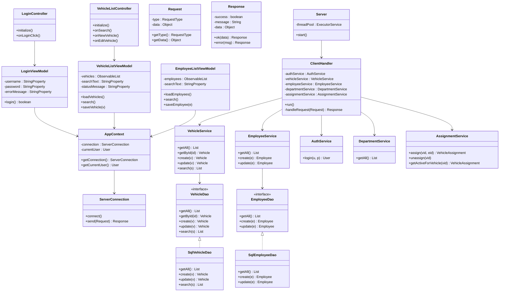

# Klassediagram – Fleet Manager arkitektur

Kopiér koden nedenfor ind på https://mermaid.live

```mermaid
classDiagram
    direction TB

    %% ── KLIENT ──────────────────────────────────
    class LoginController {
        +initialize()
        +onLoginClick()
    }
    class LoginViewModel {
        -username : StringProperty
        -password : StringProperty
        -errorMessage : StringProperty
        +login() boolean
    }
    class VehicleListController {
        +initialize()
        +onSearch()
        +onNewVehicle()
        +onEditVehicle()
    }
    class VehicleListViewModel {
        -vehicles : ObservableList
        -searchText : StringProperty
        -statusMessage : StringProperty
        +loadVehicles()
        +search()
        +saveVehicle(v)
    }
    class EmployeeListViewModel {
        -employees : ObservableList
        -searchText : StringProperty
        +loadEmployees()
        +search()
        +saveEmployee(e)
    }
    class ServerConnection {
        +connect()
        +send(Request) Response
    }
    class AppContext {
        -connection : ServerConnection
        -currentUser : User
        +getConnection() ServerConnection
        +getCurrentUser() User
    }

    %% ── SHARED ──────────────────────────────────
    class Request {
        -type : RequestType
        -data : Object
        +getType() RequestType
        +getData() Object
    }
    class Response {
        -success : boolean
        -message : String
        -data : Object
        +ok(data) Response
        +error(msg) Response
    }

    %% ── SERVER ──────────────────────────────────
    class Server {
        -threadPool : ExecutorService
        +start()
    }
    class ClientHandler {
        -authService : AuthService
        -vehicleService : VehicleService
        -employeeService : EmployeeService
        -departmentService : DepartmentService
        -assignmentService : AssignmentService
        +run()
        -handleRequest(Request) Response
    }
    class VehicleService {
        +getAll() List
        +getById(id) Vehicle
        +create(v) Vehicle
        +update(v) Vehicle
        +search(s) List
    }
    class EmployeeService {
        +getAll() List
        +create(e) Employee
        +update(e) Employee
    }
    class AuthService {
        +login(u, p) User
    }
    class DepartmentService {
        +getAll() List
    }
    class AssignmentService {
        +assign(vid, eid) VehicleAssignment
        +unassign(vid)
        +getActiveForVehicle(vid) VehicleAssignment
    }

    %% ── DAO INTERFACES ──────────────────────────
    class VehicleDao {
        <<interface>>
        +getAll() List
        +getById(id) Vehicle
        +create(v) Vehicle
        +update(v) Vehicle
        +search(s) List
    }
    class EmployeeDao {
        <<interface>>
        +getAll() List
        +create(e) Employee
        +update(e) Employee
    }
    class SqlVehicleDao {
        +getAll() List
        +create(v) Vehicle
        +update(v) Vehicle
        +search(s) List
    }
    class SqlEmployeeDao {
        +getAll() List
        +create(e) Employee
        +update(e) Employee
    }

    %% ── RELATIONER ──────────────────────────────
    LoginController --> LoginViewModel
    VehicleListController --> VehicleListViewModel
    LoginViewModel --> AppContext
    VehicleListViewModel --> AppContext
    EmployeeListViewModel --> AppContext
    AppContext --> ServerConnection

    Server --> ClientHandler
    ClientHandler --> VehicleService
    ClientHandler --> EmployeeService
    ClientHandler --> AuthService
    ClientHandler --> DepartmentService
    ClientHandler --> AssignmentService
    VehicleService --> VehicleDao
    EmployeeService --> EmployeeDao
    VehicleDao <|.. SqlVehicleDao
    EmployeeDao <|.. SqlEmployeeDao
```
