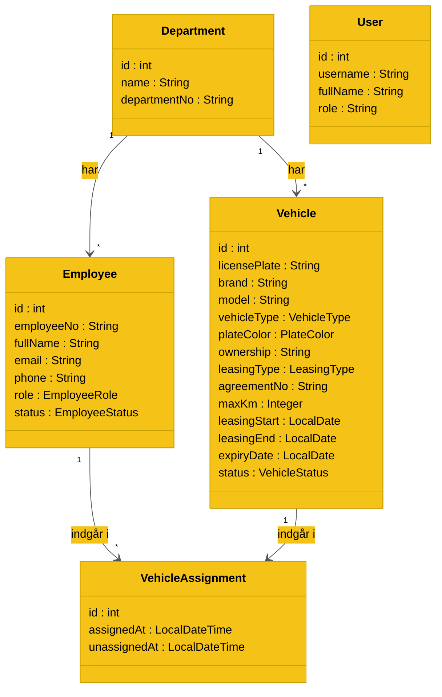

# Domænemodel – Fleet Manager

Kopiér koden nedenfor ind på https://mermaid.live

```mermaid
%%{init: {'theme': 'base', 'themeVariables': {'primaryColor': '#f5c218', 'primaryTextColor': '#000', 'primaryBorderColor': '#c8a000', 'lineColor': '#555', 'secondaryColor': '#fffde7'}}}%%
classDiagram
    direction TB

    class Department {
        id : int
        name : String
        departmentNo : String
    }

    class User {
        id : int
        username : String
        fullName : String
        role : String
    }

    class Employee {
        id : int
        employeeNo : String
        fullName : String
        email : String
        phone : String
        role : EmployeeRole
        status : EmployeeStatus
    }

    class Vehicle {
        id : int
        licensePlate : String
        brand : String
        model : String
        vehicleType : VehicleType
        plateColor : PlateColor
        ownership : String
        leasingType : LeasingType
        agreementNo : String
        maxKm : Integer
        leasingStart : LocalDate
        leasingEnd : LocalDate
        expiryDate : LocalDate
        status : VehicleStatus
    }

    class VehicleAssignment {
        id : int
        assignedAt : LocalDateTime
        unassignedAt : LocalDateTime
    }

    Department "1" --> "*" Employee : har
    Department "1" --> "*" Vehicle : har
    Employee "1" --> "*" VehicleAssignment : indgår i
    Vehicle "1" --> "*" VehicleAssignment : indgår i
```
