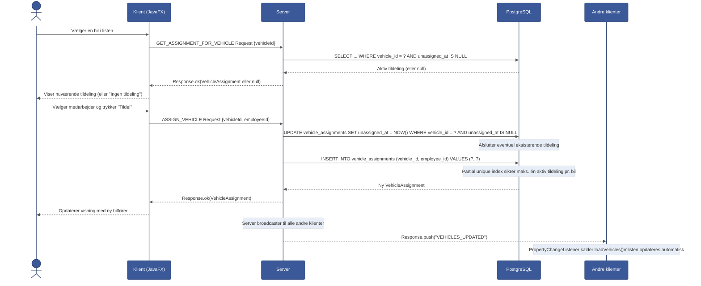

# Systemsekvensdiagram – UC09 Tildel bil til medarbejder

Kopiér koden nedenfor ind på https://mermaid.live

```mermaid
%%{init: {'theme': 'base', 'themeVariables': {'primaryColor': '#3B5998', 'primaryTextColor': '#333', 'primaryBorderColor': '#2C4170', 'lineColor': '#555', 'secondaryColor': '#E8EEF7', 'actorBkg': '#3B5998', 'actorTextColor': '#fff', 'actorBorderColor': '#2C4170', 'signalColor': '#555', 'signalTextColor': '#333', 'noteBkgColor': '#E8EEF7', 'noteTextColor': '#333'}}}%%
sequenceDiagram
    actor FA as Flådeansvarlig
    participant K as Klient (JavaFX)
    participant S as Server
    participant DB as PostgreSQL
    participant K2 as Andre klienter

    FA->>K: Vælger en bil i listen
    K->>S: GET_ASSIGNMENT_FOR_VEHICLE Request {vehicleId}
    S->>DB: SELECT ... WHERE vehicle_id = ? AND unassigned_at IS NULL
    DB-->>S: Aktiv tildeling (eller null)
    S-->>K: Response.ok(VehicleAssignment eller null)
    K-->>FA: Viser nuværende tildeling (eller "Ingen tildeling")

    FA->>K: Vælger medarbejder og trykker "Tildel"
    K->>S: ASSIGN_VEHICLE Request {vehicleId, employeeId}

    S->>DB: UPDATE vehicle_assignments SET unassigned_at = NOW() WHERE vehicle_id = ? AND unassigned_at IS NULL
    Note over DB: Afslutter eventuel eksisterende tildeling

    S->>DB: INSERT INTO vehicle_assignments (vehicle_id, employee_id) VALUES (?, ?)
    Note over DB: Partial unique index sikrer maks. én aktiv tildeling pr. bil

    DB-->>S: Ny VehicleAssignment
    S-->>K: Response.ok(VehicleAssignment)
    K-->>FA: Opdaterer visning med ny bilfører

    Note over S: Server broadcaster til alle andre klienter
    S-->>K2: Response.push("VEHICLES_UPDATED")
    Note over K2: PropertyChangeListener kalder loadVehicles()\nlisten opdateres automatisk
```
