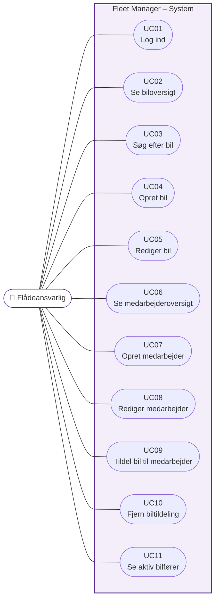

# Use Case Diagram – Fleet Manager

Kopiér koden nedenfor ind på https://mermaid.live

```mermaid
flowchart LR
    actor(["👤 Flådeansvarlig"])

    subgraph system["Fleet Manager – System"]
        direction TB
        UC01(["UC01\nLog ind"])
        UC02(["UC02\nSe biloversigt"])
        UC03(["UC03\nSøg efter bil"])
        UC04(["UC04\nOpret bil"])
        UC05(["UC05\nRediger bil"])
        UC06(["UC06\nSe medarbejderoversigt"])
        UC07(["UC07\nOpret medarbejder"])
        UC08(["UC08\nRediger medarbejder"])
        UC09(["UC09\nTildel bil til medarbejder"])
        UC10(["UC10\nFjern biltildeling"])
        UC11(["UC11\nSe aktiv bilfører"])
    end

    actor --- UC01
    actor --- UC02
    actor --- UC03
    actor --- UC04
    actor --- UC05
    actor --- UC06
    actor --- UC07
    actor --- UC08
    actor --- UC09
    actor --- UC10
    actor --- UC11

    style system fill:#f3eef9,stroke:#5c2d91,stroke-width:2px
    style actor fill:#fff,stroke:#5c2d91
```
